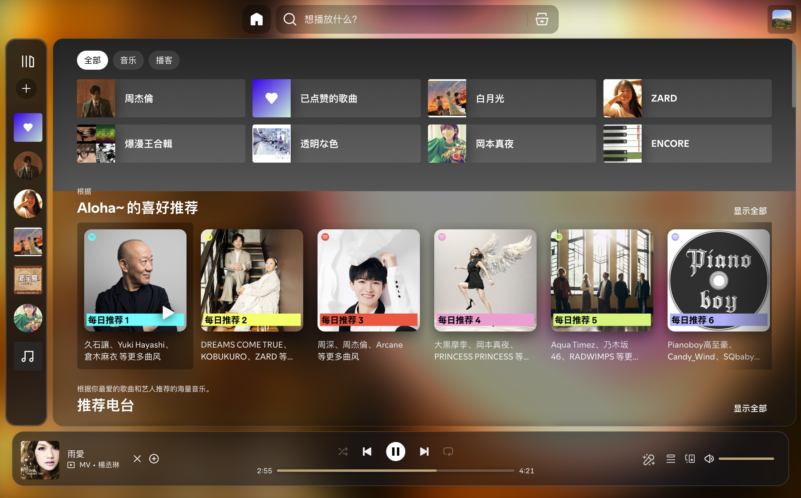

# Spicetify Hazy - Apple Music Lyrics Edition
> 深度定制的 Spotify Hazy 主题，融入 Apple Music 原生质感全屏动态歌词、状态级平滑跳转算法、毛玻璃播控底栏与极致性能优化。


---

## ✨ 核心特性

### 1. 🍎 极致拟真的 Apple Music 全屏歌词
- **原生流动动态背景**：完美还原 Apple Music 随音频律动的主题光斑渐变流动，告别单调纯色背景。
- **逐字扫光与平滑动画**：支持 Apple Music 级别的字词进度扫光、呼吸光晕与逐字点亮；
- **原生层级排版**：精细校准的文字字重、层级行距与微光渐隐，上下留白舒适平衡。

### 2. ⚡ 状态级平滑跳转算法 (Zero-Snapback Seek Proxy)
- **彻底杜绝回弹抖动**：深度反向工程歌词同步引擎，针对 Spotify 后端音频引擎 200~500ms 的网络与缓冲延迟，建立底层预测式时间平滑代理。
- **0ms 回退响应**：无论是手动拖动滑块跳转，还是点击任意歌词单句跳播，滑块与歌词均保持平滑递增，告别以往令人难受的“先倒退后前冲”闪烁抽搐。
- **中文字词点击穿透增强**：全面适配中文多字结构与注音分词，任意汉字与空白间隙均可即点即跳。

### 3. 🎵 严格单一全屏歌词体验 (Strict Single Lyrics View)
- **剔除多余歌词入口**：隐藏 Spotify 原生歌词按钮与 SpicyLyrics 注入播放栏的全部歌词按钮（含画中画/全屏入口），界面保持纯净；进入歌词的唯一入口为左下角封面。
- **全局一键直达**：点击左下角正在播放的封面，直接呼出 Apple Music 全屏沉浸歌词；关闭时干净退回当前浏览页面，不留任何多余中间态。

### 4. 🎛️ 经典高精度进度条与三合一播控 (Classic Timeline & 3-in-1 Controls)
- **经典高精度进度条**：还原最初插件备受好评的细腻进度条与分秒实时时间指示。
- **顺序/随机/单曲循环三态合一**：将「顺序播放」、「随机播放」、「单曲循环」三项合为一体化单键，点击循环切换，图标实时反馈，节省宝贵视口空间。
- **原生级播控按钮排版**：上一首、播放/暂停、下一首微光控制按钮精巧排布，交互舒适灵敏。

### 5. 🔲 极致居中「无图纯歌词模式」& 悬浮微光播控底栏 (Pure Lyrics & Floating Dock)
- **黄金居中文字排版**：点击顶部胶囊 `[ ◫ ]` 按钮平滑收起封面，大字号歌词填满全屏，上下各留出充足安全边距，当前歌词处于视觉黄金分割线，已唱与未唱段落渐隐层次分明。
- **全新悬浮微光药丸底栏**：在无图模式下优雅浮现在底部中央，集成封面缩略图、曲目信息、高精度交互进度条与三合一循环/随机播控。
- **沉浸式交互联动**：仅在无图歌词模式呈现；鼠标静止 3.5 秒后自动柔和隐退，晃动鼠标即刻苏醒，分栏模式自动归位收起。

### 6. ⏳ 鼠标静止沉浸隐藏 (Inactivity Auto-Fade)
- 在全屏播放状态下，鼠标静止 3.5 秒后，顶部控制栏、底部播控栏与鼠标光标将**平滑淡出隐去**。
- 轻轻滑动触控板或敲击按键即可瞬时无感唤醒，享受纯粹如同 Apple TV 般的听歌沉浸感。

### 7. 🇯🇵 日语假名注音、罗马音与多语言排版
- 针对 SpicyLyrics 的多语言歌词注音（`ruby` / `rt` 假名及罗马音）与双语翻译（`translation`）进行字重、间距与微光质感重构。
- 译文与注音跟随 Apple Music 专属层级比例缩放（0.72em / 0.44em），激活行具备专属发光文字阴影。

### 8. 🌌 暗黑/单色专辑环境光基底 (Anti-Dead-Dark Ambient Layer)
- 独家调校的环境光补偿层（Ambient Radial Gradient），自动防止全黑或纯色冷淡专辑封面跌入「死黑虚空」，始终保持 Apple 质感的幽邃通透光晕。

### 9. 🧹 纯粹原生界面：完全剔除顶栏设置铅笔与冗余元素
- **彻底移除顶栏「主题设置」铅笔按钮**：告别原版多余的悬浮配置弹窗与滑块，顶栏回归如同 macOS 原生应用般的纯粹极简，默认直接锁死 Apple 原生最优透光度。
- **清除底栏多余元素**：彻底移除底栏头像后的垃圾桶按钮、右侧麦克风按钮及重复的迷你播放器图标。
- **剔除多余滚动条**：全屏模式下彻底隐藏右侧滚动条（SimpleBar / WebKit Scrollbar），视觉边界纯净无瑕疵。

### 10. ⚡ 极致性能引擎：告别首页与歌词缩放拖拽卡顿 (Zero-Lag Resize Engine)
- **动态拖拽拦截系统（Zero-Lag Drag Engine）**：监听窗口 resize 事件，在拖拽/缩放期间给 `<body>` 挂载 `is-resizing` 状态：全面停用所有毛玻璃（backdrop-filter）与渐变遮罩（mask-image），专辑背景的模糊滤镜从 24px **缓动降级**至 10px（保持磨砂观感不变清晰），停止拖拽 200ms 后平滑恢复原状。
- **首页货架布局隔离（Layout Containment）**：为首页所有推荐卡片栏与货架（`[data-testid="component-shelf"]`, `.main-shelf-shelf`）开启 CSS `contain: layout style` + `content-visibility: auto`，彻底杜绝单行卡片宽度变动引发的全页面级重排风暴（Reflow Thrashing）。
- **消除双重重叠毛玻璃**：取消主视口内部容器（`.main-view-container`）的多余毛玻璃与阴影图层，仅保留最外层单层高质感磨砂，大幅释放 GPU 显存带宽与 Fill Rate。
- **剔除同步滚动重流（Layout Thrashing）**：重构 `galaxyFade` 滚动监听器与 `ResizeObserver`，消除窗口尺寸变化时在非歌词页面对 `scrollHeight` / `calculateLyricsMaxWidth` 的强制同步读取，保持 60/120fps ProMotion 极致流畅。

---

## 📸 界面预览

| 经典分栏全屏歌词 | 沉浸式无图纯歌词模式（含悬浮底栏） |
| :---: | :---: |
|  |  |

| 极简原生主界面与精简播放栏 |
| :---: |
|  |

---

## 🚀 一键安装与使用指南

### 方式一：一键极速安装（推荐）

#### 🍎 macOS & Linux
直接在终端中粘贴运行以下命令：
```bash
curl -fsSL https://raw.githubusercontent.com/kimi-ni-aitaku/spicetify-hazy-applemusic/main/install.sh | bash
```

#### 🪟 Windows (PowerShell)
以普通用户身份打开 PowerShell 运行：
```powershell
irm https://raw.githubusercontent.com/kimi-ni-aitaku/spicetify-hazy-applemusic/main/install.ps1 | iex
```

*脚本会自动检测 Spicetify 环境、下载/更新最新主题文件、配置并自动关联 SpicyLyrics 扩展并秒级生效。*

---

### 方式二：手动安装

1. **克隆本仓库到 Spicetify 主题目录**：
   ```bash
   cd "$(spicetify -c | xargs dirname)/Themes"
   git clone https://github.com/kimi-ni-aitaku/spicetify-hazy-applemusic.git Hazy
   ```

2. **配置 Spicetify 启用该主题及歌词扩展**：
   ```bash
   spicetify config current_theme Hazy
   spicetify config extensions spicy-lyrics.mjs
   spicetify apply
   ```

---

## 💡 快捷键与常用操作
- **进入全屏歌词**：点击左下角「正在播放的封面」。
- **退出全屏歌词**：按键盘 `ESC`、点击右上角 `[ ✕ ]`，或再次点击左下角封面。
- **切换无图纯歌词模式**：点击右上角 `[ ◫ ]` 按钮。
- **切换注音模式**：点击右上角 `[ 文A ]` 按钮。
- **切换播放模式**：点击封面下方或无图底栏的播放模式按钮，在「顺序播放 ➔ 随机播放 ➔ 单曲循环」之间一键切换。

---

## 🛠 故障排查与开关

### 关闭防回弹跳转补丁（逃生开关）
主题对 Spotify 播放内核做了预测式跳转补丁。如果 Spotify/Spicetify 更新后歌词同步出现异常，可在 DevTools 控制台（Spicetify 默认已开启，`Ctrl+Shift+I` / `Cmd+Option+I`）执行：

```js
localStorage.setItem("hazy:disableOptimisticSeek", "true");
```

然后重启 Spotify（或执行 `spicetify apply`）。补丁会完全跳过，代价仅为拖动进度条时歌词可能有一瞬回弹。恢复补丁：

```js
localStorage.removeItem("hazy:disableOptimisticSeek");
```

补丁本身也带自动降级保护：安装过程抛错时会自动禁用并在控制台输出 `[Hazy] optimistic seek wrapper disabled due to error`，不会冻住歌词。

### 🩹 本版本修复日志（2025）
- 修复新版 Spicetify `isPlaying` 属性化导致逐字歌词动画冻结（统一封装为 `getPlayerPaused()`，兼容新旧 API）
- 实现真正生效的 `body.is-resizing` 缩放零卡顿引擎（含背景模糊缓动降级，不再变清晰）
- 修复 `Spicetify.Player.seek` 毫秒被误判为比例（歌曲前 1 秒内跳转错位）
- 修复首次运行可能将 `spicetify-exp-features` 写坏为 `"null"` 的问题
- 修复 `lyricsObserver.disconnect` 缺少括号导致的 observer 泄漏
- 修复 matchMedia 代理 bound 函数未缓存导致 `removeEventListener` 失败的监听器泄漏
- 主色提取改为 RGB 量化桶统计，解决 JPEG 封面统计不出主色、频繁落入兜底蓝灰色的问题
- 切歌元数据残缺时短路等待重试；头像菜单 Observer 合帧节流
- SpicyLyrics 播放栏按钮隐藏兼容多版本（CSS 前缀选择器 + JS 兜底扫描）

---

## 📄 开源许可
基于 MIT License 开源。
