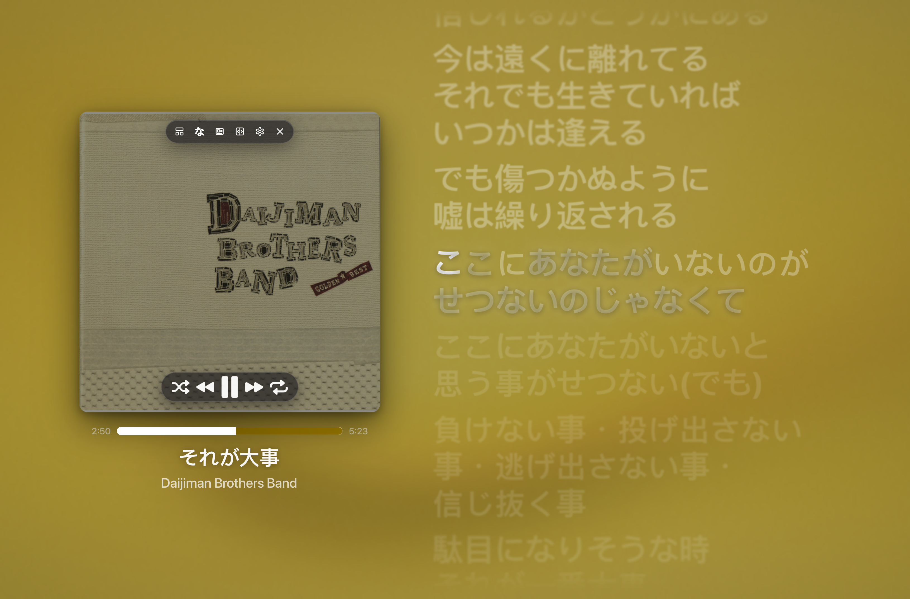
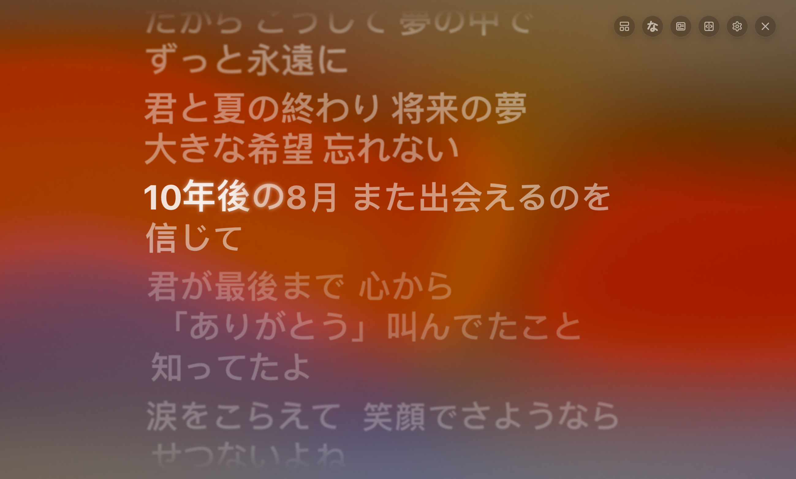
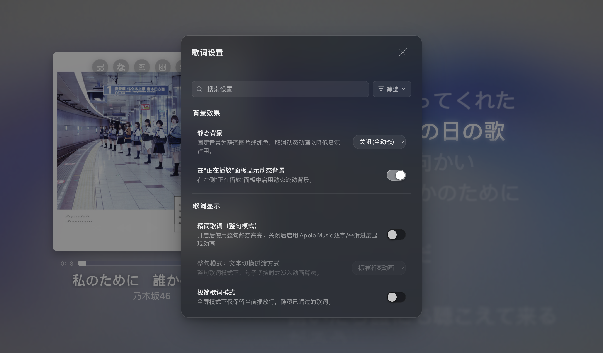
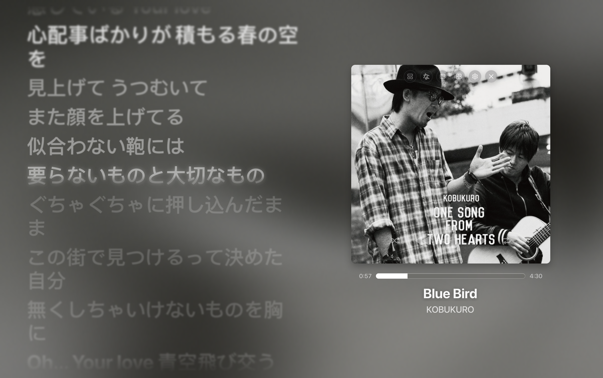

# Spicetify Hazy - Apple Music Lyrics Edition
> 深度定制的 Spotify Hazy 主题，融入 Apple Music 原生质感全屏动态歌词、毛玻璃封面控制纽扣与极致性能优化。



---

## ✨ 核心特性

### 1. 🍎 极致拟真的 Apple Music 全屏歌词
- **原生流动动态背景**：告别纯色图层遮挡，完美还原 Apple Music 随音频律动的主题光斑渐变流动。
- **逐字扫光与整句高亮双模式**：
  - **逐字/平滑动画模式**：支持 Apple Music 级别的字词进度扫光、呼吸光晕与逐字点亮；
  - **整句模式**：整行高亮与平滑淡入切换，适合极简低能耗环境；
  - 两种模式可在设置中随时一键自由切换。
- **Apple Music 原生排版**：精细校准的文字字重、层级行距与微光渐隐。

### 2. 🎛️ 一体化毛玻璃胶囊控制栏 (Unified Frosted Capsule Controls)
- 将歌词控制栏精致嵌入到专辑封面（`MediaContent`）正上方中央，告别分散凌乱的纽扣。
- 采用 Apple Music 风格的一体化高透暗色毛玻璃药丸胶囊（`backdrop-filter: blur(28px)`），黑白反差自适应，微弹动效交互。
- 完整集成 6 大核心按钮：
  - `[ ⬚ ] 紧凑封面模式`
  - `[ な ] 日语假名 / 罗马音注音`
  - `[ ◫ ] 无图模式 / 切换封面`
  - `[ ↔ ] 切换封面左右侧`
  - `[ ⚙ ] 歌词设置`
  - `[ ✕ ] 退出全屏歌词`

### 3. 🎚️ 封面悬浮微光播放条 (Hover-Grounded Playback Dock)
- 播放控制栏（随机、上一首、播放/暂停、下一首、循环）在鼠标未悬停时完全隐藏，保证专辑原画纯粹通透。
- 当鼠标悬停在封面上时，优雅的半透毛玻璃微胶囊平滑浮现，交互手感自然温润。

### 4. 🔲 独创「无图模式」(Pure Lyrics Immersion)
- 点击控制栏的 `[ ◫ ]` 按钮，专辑封面平滑收起滑出，大字号歌词填满全屏。
- 胶囊控制栏自适应平滑浮动至右上角，随时一键还原封面展示。

### 5. ⏳ 鼠标静止沉浸隐藏 (Inactivity Auto-Fade)
- 在全屏播放状态下，鼠标静止 3.5 秒后，顶部控制栏、播放进度条与鼠标光标将**平滑淡出隐去**。
- 轻轻滑动触控板或敲击按键即可瞬时无感唤醒，享受纯粹如同 Apple TV 般的听歌沉浸感。

### 6. 🌐 歌词设置全中文本地化 & 去商业推广
- 设置面板内所有功能项、开关说明、下拉菜单及实验性特性全面汉化。
- 彻底屏蔽移除原项目底部的作者社交媒体外链（Website、Discord、Ko-fi）与无用信息，保持纯净。

### 7. 🧹 播放底栏与全局精简 & 零多余滚动条
- 彻底移除播放器底栏头像后的垃圾桶按钮、右侧麦克风按钮及重复的迷你播放器图标。
- 顶栏保留极简主页与搜索，去除冗余前进后退与右上角动态广播。
- 彻底剔除全屏模式下的右侧多余滚动条（SimpleBar / WebKit Scrollbar），视觉边界纯净无瑕疵。
- 点击播放栏左下角封面直接秒级全屏；按 `ESC` 或点击 `[ ✕ ]` 瞬时退出。

### 8. ⚡ 算法与内存调度优化
- **按需渲染**：仅在激活全屏歌词时加载着色器；普通歌单与浏览界面彻底关闭动态着色器 Canvas，杜绝持续占用 GPU/CPU。
- **平滑缩放**：采用阈值消抖算法优化窗口缩放，告别拖动窗口时的突兀阶梯缩放与卡顿。

---

## 📸 界面预览

| 经典分栏全屏歌词 | 沉浸式无图纯歌词模式 |
| :---: | :---: |
|  |  |

| 全中文歌词设置 | 封面左右侧自由翻转 |
| :---: | :---: |
|  |  |

---

## 🚀 安装与使用指南

### 前置要求
- 已安装 [Spicetify CLI](https://spicetify.app/)

### 快速安装

1. **克隆本仓库到 Spicetify 主题目录**：
   ```bash
   cd "$(spicetify -c | xargs dirname)/Themes"
   git clone https://github.com/kimi-ni-aitaku/spicetify-hazy-applemusic.git Hazy
   ```

2. **配置 Spicetify 启用该主题及歌词扩展**：
   ```bash
   spicetify config current_theme Hazy
   spicetify config extensions spicy-lyrics.mjs
   spicetify apply
   ```

3. **快捷键与操作**：
   - **进入全屏歌词**：点击底栏左下角正在播放的专辑封面。
   - **退出全屏歌词**：按键盘 `ESC` 或点击封面顶部的 `[ ✕ ]` 按钮。
   - **切换无图模式**：点击封面顶部的 `[ ◫ ]` 按钮。
   - **切换逐字/整句模式**：点击封面顶部 `[ ⚙ ]` -> 在「歌词显示」中切换「精简歌词（整句模式）」。

---

## 📄 开源许可
基于 MIT License 开源。
